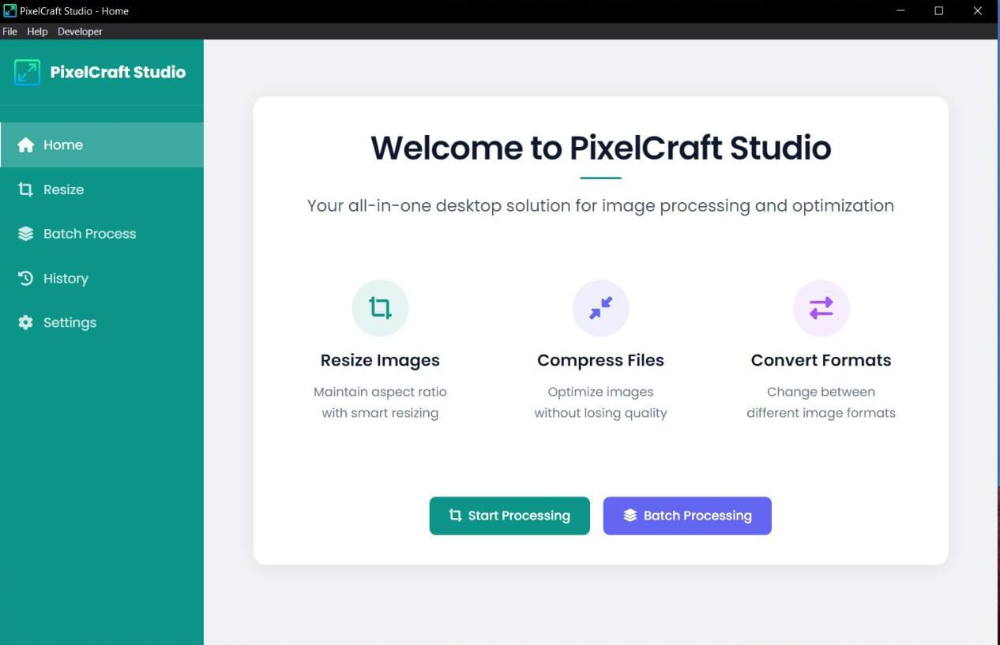

# PixelCraft Studio

<div align="center">
  
  <p><em>A comprehensive desktop solution for image processing and optimization</em></p>
</div>

## 📋 Overview

PixelCraft Studio is a powerful desktop application built with Electron that provides a comprehensive suite of image processing tools. It allows users to resize, compress, and convert images with a modern, user-friendly interface.

### Key Features

- **Image Resizing**: Resize images while maintaining aspect ratio
- **Batch Processing**: Process multiple images at once
- **Format Conversion**: Convert between different image formats
- **Image Compression**: Optimize images without losing quality
- **Processing History**: Keep track of all your processed images
- **Customizable Settings**: Configure output directory and default formats

## 🚀 Getting Started

### Prerequisites

- Node.js (v14.0.0 or higher)
- npm (v6.0.0 or higher)
- Git

### System Requirements

- **Operating System**: Windows 10/11, macOS 10.15+, or Linux
- **RAM**: 4GB minimum, 8GB recommended
- **Disk Space**: 200MB for installation
- **Display**: 1280x720 or higher resolution

### Installation

1. Clone the repository:
   ```bash
   git clone https://github.com/yourusername/pixelcraft-studio.git
   ```

2. Navigate to the project directory:
   ```bash
   cd pixelcraft-studio
   ```

3. Install dependencies:
   ```bash
   npm install
   ```

4. Start the application:
   ```bash
   npm start
   ```

### Development Mode

For development with hot reloading:

```bash
npm run dev
```

## 💻 Usage

### Image Resizing

1. Navigate to the "Resize" tab
2. Select an image by clicking on the upload area
3. Enter the desired width or height (the other dimension will be calculated automatically to maintain aspect ratio)
4. Click "Resize Image"
5. The resized image will be saved to the configured output directory

### Batch Processing

1. Navigate to the "Batch Process" tab
2. Select multiple images by clicking on the upload area
3. Choose the operation (resize, compress, or convert)
4. Configure the operation settings
5. Click "Start Batch Processing"
6. All processed images will be saved to the configured output directory

### History

- View all previously processed images in the "History" tab
- Click on an image to open it directly
- Click on the folder icon to open the containing folder
- Use the "Clear History" button to remove all history entries

### Settings

- Configure the output directory for processed images
- Set the default image format for conversions
- Enable or disable history saving

## 🛠️ Technologies Used

- **Electron**: Cross-platform desktop application framework
- **HTML/CSS/JavaScript**: Frontend development
- **Node.js**: Backend runtime
- **Sharp**: Image processing library
- **Electron Store**: Data persistence

## 🔄 Future Improvements

### Planned Features

1. **Advanced Image Editing**
   - Crop, rotate, and flip images
   - Apply filters and effects
   - Adjust brightness, contrast, and saturation

2. **Enhanced Batch Processing**
   - Custom naming patterns for output files
   - Recursive folder processing
   - Scheduled batch jobs

3. **User Interface Enhancements**
   - Dark mode support
   - Customizable themes
   - Drag-and-drop support for folders

4. **Performance Optimizations**
   - Multi-threading for batch processing
   - Memory usage optimizations
   - Processing queue management

5. **Export/Import Capabilities**
   - Export processing presets
   - Import settings from other instances
   - Backup and restore functionality

## 👥 Contributing

Contributions are welcome! Please feel free to submit a Pull Request.

1. Fork the repository
2. Create your feature branch (`git checkout -b feature/amazing-feature`)
3. Commit your changes (`git commit -m 'Add some amazing feature'`)
4. Push to the branch (`git push origin feature/amazing-feature`)
5. Open a Pull Request

---

<div align="center">
  <p>Made with ❤️ using Electron</p>
</div>